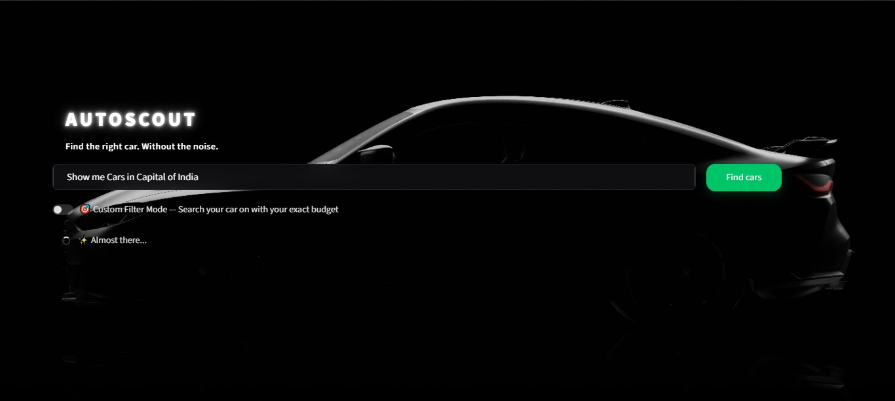
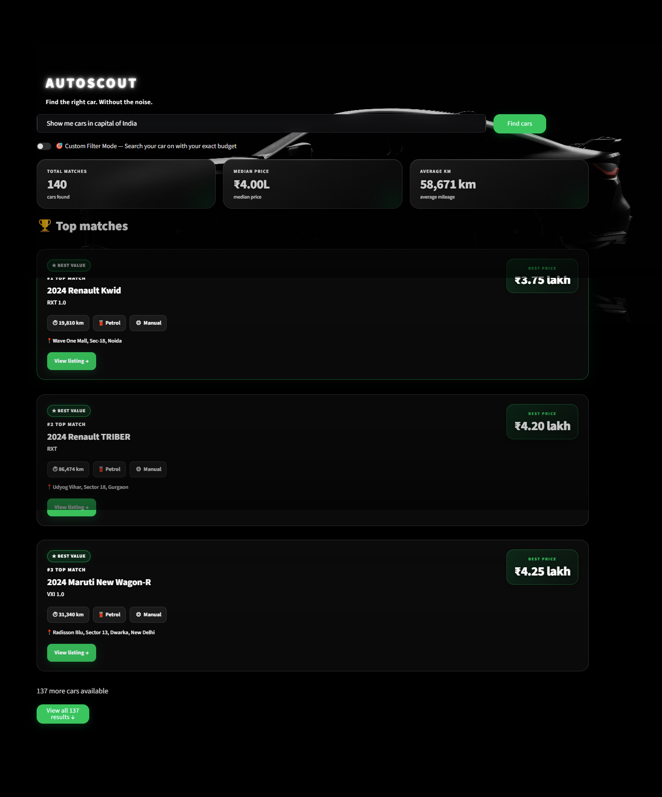
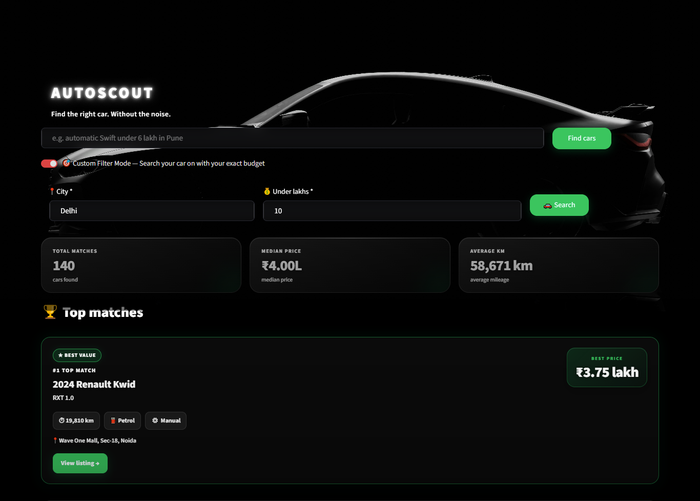

# 🚗 AutoScout

### Find the right used car. Without the noise.

AutoScout is a simple used-car discovery application that helps users find cars from **Cars24** using a natural-language search.

Instead of manually opening Cars24, applying filters, scrolling through hundreds of cars, and comparing prices, AutoScout does the work for you.

You can simply type something like:

> **"Find an automatic Swift under 6 lakh in Pune"**

AutoScout searches the available listings, organizes the results, and highlights the cars that offer better value.



## 🌟 What Can AutoScout Do?

AutoScout currently supports two ways of searching.

### 1. 🔎 Natural Search

You can search using normal language.

For example:

```text
automatic Swift under 6 lakh in Pune
```

or:

```text
Show me cars in capital of India
```

AutoScout identifies the city from your query and searches for available cars. - Backed by Gemini

---

### 2. 🎯 Custom Filter Mode

If you already know your exact budget and city, you can use Custom Filter Mode.

For example:

```text
City: Pune
Budget: 10 Lakhs
```

AutoScout creates the appropriate Cars24 search URL and fetches the listings.

---

## 🧠 How Does It Work?

Think of AutoScout like a small assistant.

You give it a request:

```text
"Find cars in Pune"
```

Then AutoScout performs these steps:

```text
User
  ↓
Search Query
  ↓
Find City
(Regex → Gemini if needed)
  ↓
Create Cars24 Search
  ↓
Bright Data
  ↓
Get Car Listings
  ↓
Clean the Data
  ↓
Rank the Cars
  ↓
Add Useful Insights
  ↓
Show Results
```

### In simple words:

**You ask → AutoScout searches → AutoScout cleans → AutoScout compares → You choose.**

---

## 🛠️ Technology Used

* **Python** — Main programming language
* **Streamlit** — Builds the web interface
* **Bright Data** — Collects car listings from Cars24
* **Google Gemini** — Helps identify the city when Regex cannot
* **Regex** — Quickly detects city names from searches
* **Requests** — Connects to external APIs
* **HTML & CSS** — Customizes the look and design
* **python-dotenv** — Manages API keys and environment variables

## 📁 Project Structure

<pre class="overflow-visible! px-0!" data-start="534" data-end="970"><div class="relative w-full mt-4 mb-1"><div class=""><div class="contents"><div class="relative"><div class="h-full min-h-0 min-w-0"><div class="h-full min-h-0 min-w-0"><div class="border border-token-border-light border-radius-3xl corner-superellipse/1.1 rounded-3xl"><div class="h-full w-full border-radius-3xl bg-(--code-block-surface) corner-superellipse/1.1 overflow-clip rounded-3xl [--code-block-surface:var(--bg-elevated-secondary)] dark:[--code-block-surface:var(--composer-surface-primary)] lxnfua_clipPathFallback"><div class="pointer-events-none absolute end-1.5 top-1 z-2 md:end-2 md:top-1"></div><div class="relative"><div class="pe-11 pt-3"><div class="relative z-0 flex max-w-full"><div id="code-block-viewer" dir="ltr" class="q9tKkq_viewer cm-editor z-10 light:cm-light dark:cm-light flex h-full w-full flex-col items-stretch ͼs ͼ16"><div class="cm-scroller"><pre class="cm-content q9tKkq_readonly m-0"><code><span>AutoScout/
│
├── app.py              # Main Streamlit application
├── backend.py          # Search, data fetching and processing
├── style.css           # Custom UI styling
├── car_image.jpg       # Background image
├── requirements.txt    # Required Python packages      
├── .gitignore          # Files Git should ignore
└── README.md           # Project documentation</span></code></pre></div></div></div></div></div></div></div></div></div></div></div></div></div></pre>

## Screenshots

### 📱 App Interface



### 🎯 Custom Filter Mode



<!-- Add screenshots here, e.g.: -->

<!--  -->

<!--  -->

<!--  -->

## How to install and run

```bash
git clone <your-repo-url>
cd autoscout

pip install -r requirements.txt
```

Create a `.env` file in the project root:

```
BRIGHTDATA_API_TOKEN=your_bright_data_token
GEMINI_API_KEY=your_gemini_api_key
```

Run the app:

```bash
streamlit run app.py
```

The app opens at `http://localhost:8501`.

## How ranking and insights work

Every listing is scored using a **value score** that blends two factors:

- **Recency (60% weight)** — newer model years score higher
- **Price (40% weight)** — cheaper listings (relative to the result set) score higher

Listings are sorted by this combined score, so the top of the results favors cars that are both newer and better priced, not just the cheapest option available.

On top of ranking, each listing is checked for a standout signal and tagged with an insight badge:

- 🟢 **"X% below median"** — shown when a car is priced meaningfully below the median price of the current result set
- 🟡 **"low km for age"** — shown when a car's mileage is unusually low relative to its age (based on an expected ~12,000 km/year benchmark)

Not every listing gets a badge — only ones where the data genuinely stands out.

## Important notes / limitations

- Live scraping runs through Bright Data Scraper Studio and can take 30–90+ seconds depending on Cars24's response time and how much the page needs to scroll to load listings.
- The scraper is currently built for **Cars24 only** in supported cities; unsupported cities or malformed custom filters will return a "not found" message rather than results.
- Natural language city detection uses a hybrid approach (regex first, Gemini as fallback) — very unusual phrasing may not resolve to a city correctly.
- Custom Filter Mode builds a literal Cars24 URL from user input, so the filter value must roughly follow Cars24's URL slug conventions (e.g. `tata-nexon-cars-under-10-lakhs`) to return meaningful results.
- Insight badges are heuristic-based (median price, expected mileage) and are meant as helpful signals, not guaranteed accurate valuations.

## Future improvements

- Expand scraping to additional platforms (e.g. Spinny) for cross-platform comparison
- Automated self-healing: detect scraper failures and trigger Bright Data's heal/approve flow without manual intervention
- Persist search history and saved listings across sessions
- More granular filters (brand, fuel type, transmission) in both search modes
- Richer insights (price trend over time, depreciation curve by model)

## Credits / team

Built for the **Into the Scrape-Verse** hackathon by WeMakeDevs.

Hero image via [Unsplash](https://unsplash.com/)

<!-- Add team member names / roles here -->
